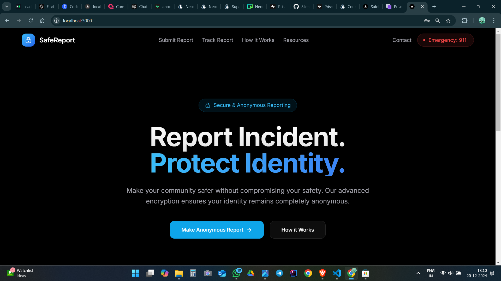
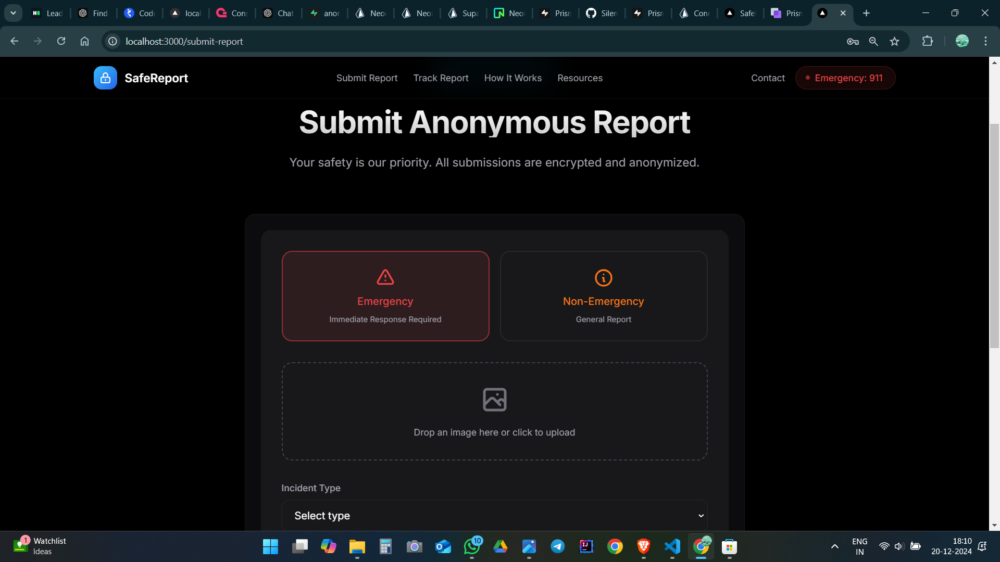
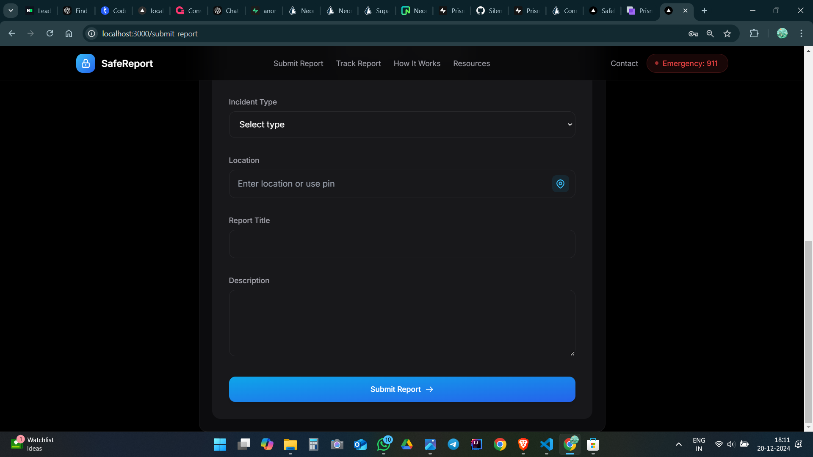
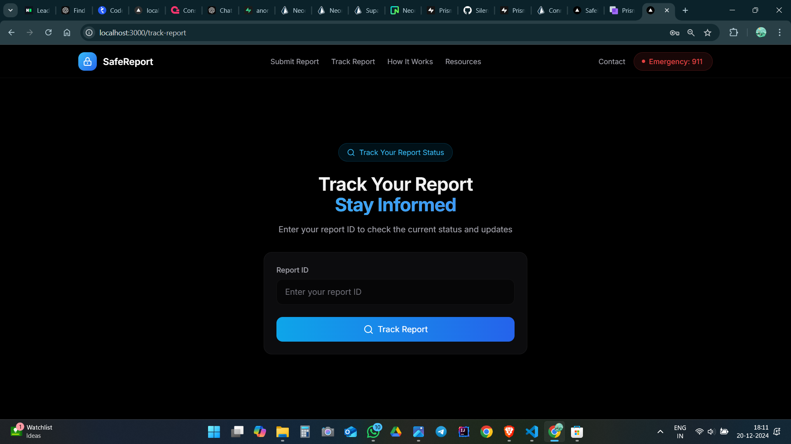
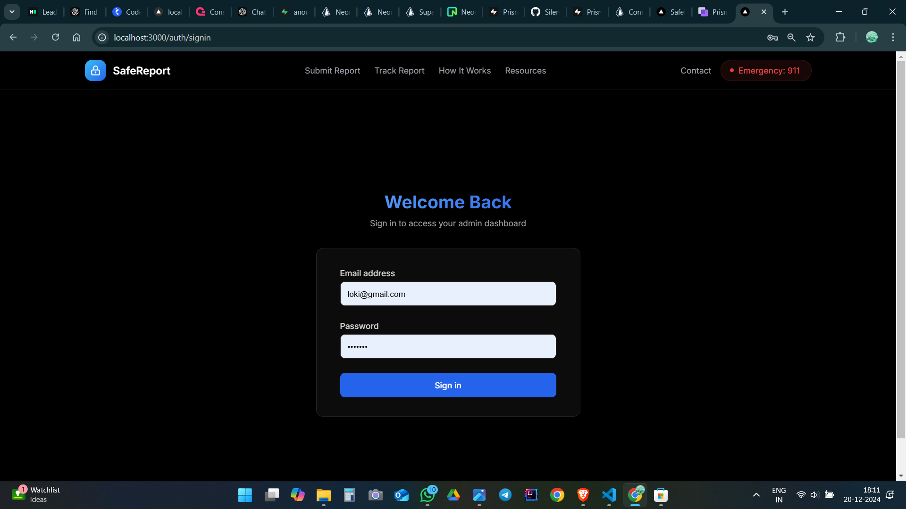
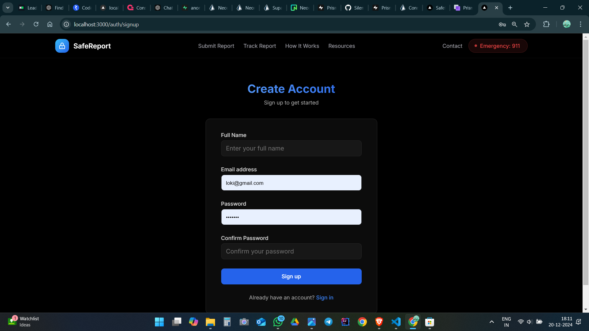
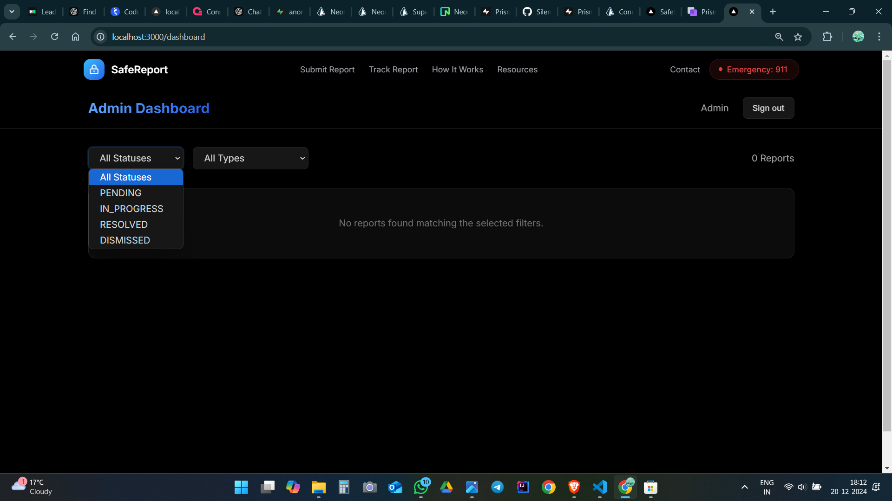

# **Anonymous Incident Reporting App** 🚨

## Screenshots

*Hero page*

This project aims to address a significant issue in India: the underreporting of incidents due to privacy concerns. The **Anonymous Incident Reporting App** allows citizens to report incidents or crimes without revealing their identity, ensuring **anonymity** while empowering users to make their communities safer.

## **Project Overview**

As 2024 comes to an end, I’m excited to share this project which provides a **secure platform** for citizens to report incidents anonymously. Using **Gemini AI** for automatic incident detection and classification, **real-time location tracking** via API integration, and **secure data handling**, this app ensures a seamless and safe reporting experience.

## **Key Features**

✅ **Automatic Incident Detection** using **Gemini AI**  
✅ **Complete Anonymity** for reporters – their identity remains hidden  
✅ **Instant Location Tracking** through API integration 🌍  
✅ **Admin Dashboard** for efficient report management 📊  
✅ **Secure Data Handling** to protect sensitive information 🔐  
✅ **User-Friendly Interface** for simple and quick reporting

## **Technologies Used**

- **Prisma** for database management  
- **Neon** for enhanced database performance  
- **Next.js** for building a responsive and modern frontend  
- **Gemini AI** for automatic incident detection and classification  
- **API integration** for real-time location tracking

## **Future Features** 🚀

🔜 **Real-Time Incident Alerts** – Notifying nearby users about ongoing incidents.  
🔜 **Multilingual Support** – Making the app accessible to users across different regions.  
🔜 **Voice-Based Reporting** – Allowing users to report incidents using voice commands.  
🔜 **Advanced Analytics** – Providing admins insights on trends, patterns, and incident locations.  
🔜 **Community Support Integration** – Letting users anonymously offer help or advice based on reports.

## Screenshots

*Hero page*

*Report submit page*

*Report submit page*

*Report Track page*

*SignIn page*

*SignUp page*

*Admin Dashboard page*
